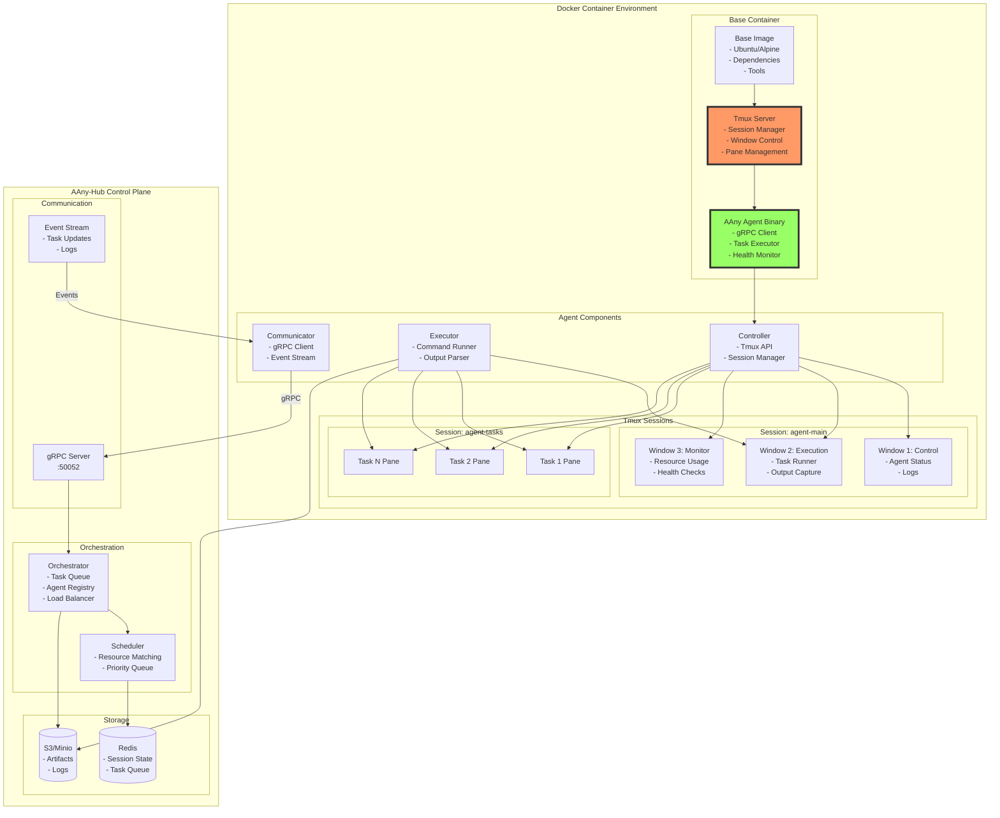
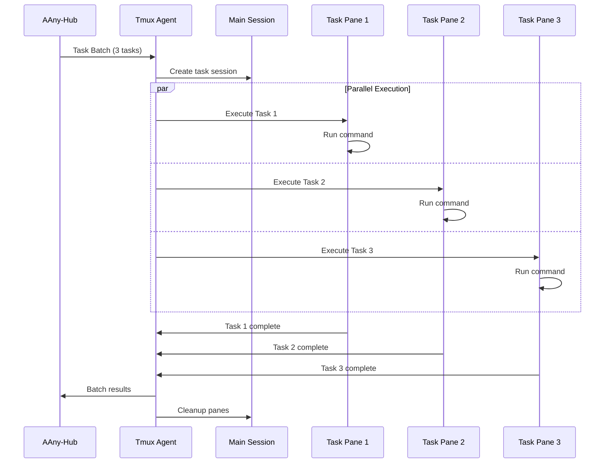
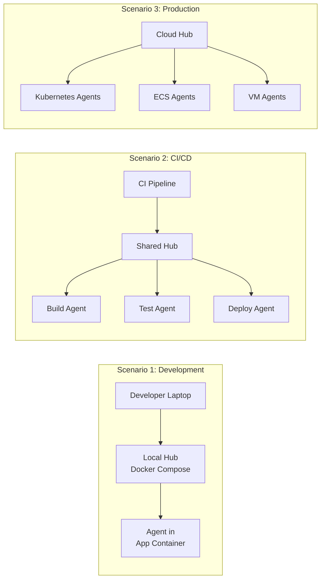

# Agent Anywhere Hub (AAny-Hub) - Tmux Agent Pool Manager Design

## Executive Summary

Agent Anywhere Hub is a lightweight tmux-based agent pool management platform. Each agent runs in a tmux session within Docker containers, providing isolation, easy deployment, and minimal overhead. The platform orchestrates these tmux-agents via gRPC for distributed task execution.

## Tmux-Agent Architecture



## Lightweight Deployment Model

### Docker Integration

```dockerfile
# Minimal agent addition to existing images
FROM your-existing-image:latest

# Install tmux and agent binary (< 50MB total)
RUN apt-get update && apt-get install -y tmux wget && \
    wget -O /usr/local/bin/aany-agent https://agent-anywhere.io/download/agent-linux-amd64 && \
    chmod +x /usr/local/bin/aany-agent && \
    apt-get clean && rm -rf /var/lib/apt/lists/*

# Agent configuration
ENV AANY_HUB_URL="grpc://hub.agent-anywhere.io:50052"
ENV AANY_AGENT_MODE="tmux"
ENV TMUX_SOCKET="/tmp/aany-tmux"

# Start script
COPY <<'EOF' /usr/local/bin/start-agent.sh
#!/bin/bash
# Start tmux server
tmux -S ${TMUX_SOCKET} new-session -d -s agent-main

# Start agent in tmux
tmux -S ${TMUX_SOCKET} send-keys -t agent-main "aany-agent start" C-m

# Keep container running
exec "$@"
EOF

RUN chmod +x /usr/local/bin/start-agent.sh

# Inject agent startup (non-intrusive)
ENTRYPOINT ["/usr/local/bin/start-agent.sh"]
CMD ["your-original-cmd"]
```

### Tmux Session Architecture

```yaml
Tmux Layout:
  agent-main:
    window-0-control:
      - Agent controller process
      - Health monitoring
      - Log aggregation
    
    window-1-execution:
      - Primary task execution
      - Output capture
      - Error handling
    
    window-2-monitor:
      - htop/resource monitoring
      - Network statistics
      - Disk usage

  agent-tasks:
    dynamic-panes:
      - One pane per parallel task
      - Automatic cleanup on completion
      - Resource isolation per pane
```

## Agent Communication Protocol

### Lightweight gRPC Design

```protobuf
syntax = "proto3";
package agenthub.tmux;

// Tmux Agent Service - Minimal footprint
service TmuxAgent {
  // Single bidirectional stream for all communication
  rpc Connect(stream AgentMessage) returns (stream HubMessage);
}

// Compact message format
message AgentMessage {
  string agent_id = 1;
  
  oneof payload {
    Registration registration = 2;
    TaskResult result = 3;
    Heartbeat heartbeat = 4;
    LogBatch logs = 5;
  }
}

message HubMessage {
  oneof payload {
    TaskRequest task = 1;
    ConfigUpdate config = 2;
    ControlCommand control = 3;
  }
}

// Tmux-specific messages
message TaskRequest {
  string task_id = 1;
  string command = 2;
  map<string, string> env = 3;
  TmuxOptions tmux = 4;
}

message TmuxOptions {
  string session = 1;
  string window = 2;
  int32 pane = 3;
  bool new_pane = 4;
  string working_dir = 5;
}

message TaskResult {
  string task_id = 1;
  int32 exit_code = 2;
  string stdout = 3;
  string stderr = 4;
  int64 duration_ms = 5;
}
```

### Agent Implementation

```go
package main

import (
    "context"
    "fmt"
    "os/exec"
    "strings"
    "time"
    
    "google.golang.org/grpc"
    pb "agenthub/proto/tmux"
)

type TmuxAgent struct {
    id       string
    socket   string
    hubConn  *grpc.ClientConn
    stream   pb.TmuxAgent_ConnectClient
    tasks    map[string]*Task
}

// Tmux command wrapper
func (a *TmuxAgent) tmuxCmd(args ...string) (string, error) {
    cmd := exec.Command("tmux", append([]string{"-S", a.socket}, args...)...)
    output, err := cmd.Output()
    return string(output), err
}

// Execute task in tmux
func (a *TmuxAgent) executeTask(req *pb.TaskRequest) (*pb.TaskResult, error) {
    start := time.Now()
    
    // Create new pane if requested
    paneID := req.Tmux.Session + ":" + req.Tmux.Window
    if req.Tmux.NewPane {
        _, err := a.tmuxCmd("split-window", "-t", paneID, "-d")
        if err != nil {
            return nil, fmt.Errorf("failed to create pane: %v", err)
        }
    }
    
    // Set working directory
    if req.Tmux.WorkingDir != "" {
        a.tmuxCmd("send-keys", "-t", paneID, 
            fmt.Sprintf("cd %s", req.Tmux.WorkingDir), "C-m")
    }
    
    // Set environment variables
    for k, v := range req.Env {
        a.tmuxCmd("send-keys", "-t", paneID, 
            fmt.Sprintf("export %s='%s'", k, v), "C-m")
    }
    
    // Execute command
    a.tmuxCmd("send-keys", "-t", paneID, req.Command, "C-m")
    
    // Capture output
    output, _ := a.tmuxCmd("capture-pane", "-t", paneID, "-p")
    
    return &pb.TaskResult{
        TaskId:     req.TaskId,
        ExitCode:   0, // Would need proper exit code capture
        Stdout:     output,
        DurationMs: time.Since(start).Milliseconds(),
    }, nil
}

// Lightweight health check
func (a *TmuxAgent) healthCheck() error {
    sessions, err := a.tmuxCmd("list-sessions", "-F", "#{session_name}")
    if err != nil {
        return fmt.Errorf("tmux not responsive: %v", err)
    }
    
    if !strings.Contains(sessions, "agent-main") {
        return fmt.Errorf("agent-main session missing")
    }
    
    return nil
}
```

## Deployment Patterns

### 1. Sidecar Pattern

```yaml
apiVersion: v1
kind: Pod
metadata:
  name: app-with-agent
spec:
  containers:
  - name: main-app
    image: your-app:latest
    # Your main application
    
  - name: aany-agent
    image: agent-anywhere/tmux-agent:latest
    env:
    - name: AANY_HUB_URL
      value: "grpc://hub.agent-anywhere.io:50052"
    - name: AANY_AGENT_TOKEN
      valueFrom:
        secretKeyRef:
          name: agent-credentials
          key: token
    volumeMounts:
    - name: shared-data
      mountPath: /data
    
  volumes:
  - name: shared-data
    emptyDir: {}
```

### 2. Init Container Pattern

```yaml
apiVersion: v1
kind: Pod
metadata:
  name: app-with-agent-init
spec:
  initContainers:
  - name: install-agent
    image: agent-anywhere/installer:latest
    command: ["/install-agent.sh"]
    volumeMounts:
    - name: agent-bin
      mountPath: /target
      
  containers:
  - name: main-app
    image: your-app:latest
    command: ["/agent-bin/start-with-agent.sh"]
    volumeMounts:
    - name: agent-bin
      mountPath: /agent-bin
      
  volumes:
  - name: agent-bin
    emptyDir: {}
```

### 3. Minimal Dockerfile Addition

```dockerfile
# One-line agent addition
FROM your-image:latest
RUN curl -sSL https://agent-anywhere.io/install.sh | sh

# Or with specific version
FROM your-image:latest
RUN curl -sSL https://agent-anywhere.io/install.sh | sh -s -- v1.2.3
```

## Task Execution Patterns

### Parallel Task Execution



### Resource Management

```yaml
Tmux Resource Control:
  Pane Limits:
    max_panes_per_window: 10
    max_windows_per_session: 5
    max_sessions: 3
    
  Memory Management:
    # Tmux uses minimal memory (~2MB per session)
    # Agent binary: ~20MB
    # Total overhead: < 50MB
    
  CPU Management:
    # Tasks inherit container cgroup limits
    # No additional overhead from agent
    
  Cleanup Policy:
    idle_pane_timeout: 5m
    completed_task_retention: 1h
    log_rotation: daily
```

## Monitoring & Observability

### Lightweight Metrics

```go
// Minimal metrics collection
type AgentMetrics struct {
    ActiveTasks   int
    CompletedTasks int
    FailedTasks   int
    TmuxSessions  int
    TmuxPanes     int
    CPUPercent    float64
    MemoryMB      int64
}

func (a *TmuxAgent) collectMetrics() (*AgentMetrics, error) {
    metrics := &AgentMetrics{}
    
    // Count tmux sessions/panes
    sessions, _ := a.tmuxCmd("list-sessions", "-F", "#{session_name}")
    metrics.TmuxSessions = len(strings.Split(sessions, "\n"))
    
    panes, _ := a.tmuxCmd("list-panes", "-a", "-F", "#{pane_id}")
    metrics.TmuxPanes = len(strings.Split(panes, "\n"))
    
    // Get resource usage (lightweight)
    cmd := exec.Command("ps", "aux")
    output, _ := cmd.Output()
    // Parse ps output for CPU/Memory
    
    return metrics, nil
}
```

### Log Aggregation

```bash
#!/bin/bash
# Lightweight log collection from tmux

# Capture all pane output
for session in $(tmux list-sessions -F '#{session_name}'); do
    for pane in $(tmux list-panes -t $session -F '#{pane_id}'); do
        tmux capture-pane -t $pane -p > /tmp/logs/${session}_${pane}.log
    done
done

# Ship to hub
aany-agent logs push /tmp/logs/*.log
```

## Security Model

### Container Security

```yaml
Security Features:
  Process Isolation:
    - Tmux runs as non-root
    - Each pane has separate PID namespace
    - No privilege escalation
    
  Network Security:
    - gRPC with mTLS
    - Agent authentication via tokens
    - Encrypted communication
    
  File System:
    - Read-only root filesystem compatible
    - Temporary directories for logs
    - No persistent state required
```

### Agent Permissions

```json
{
  "agent_capabilities": {
    "allowed_commands": ["*"],
    "denied_commands": ["rm -rf /", "dd if=/dev/zero"],
    "max_execution_time": "1h",
    "max_output_size": "10MB",
    "allowed_directories": ["/tmp", "/data", "/workspace"],
    "environment_whitelist": ["PATH", "HOME", "USER"]
  }
}
```

## Hub Integration

### Minimal Hub Requirements

```yaml
Hub Services:
  Core:
    - gRPC endpoint (single port: 50052)
    - Redis for task queue
    - S3-compatible storage for artifacts
    
  Optional:
    - Prometheus for metrics
    - Grafana for dashboards
    - ELK for log aggregation
```

### Deployment Scenarios



## Implementation Roadmap

### Phase 1: MVP (Week 1-2)
- Basic tmux agent binary (<25MB)
- Simple task execution
- gRPC communication
- Docker integration

### Phase 2: Enhanced (Week 3-4)
- Parallel task support
- Log streaming
- Basic metrics
- Multi-platform support

### Phase 3: Production (Week 5-6)
- mTLS security
- Auto-discovery
- Resource limits
- Health checks

### Phase 4: Advanced (Week 7-8)
- Task templates
- Plugin system
- Advanced scheduling
- Multi-region support

## Benefits

1. **Minimal Footprint**: < 50MB total overhead
2. **Easy Integration**: One-line Dockerfile addition
3. **No Dependencies**: Just tmux + agent binary
4. **Universal**: Works in any container/VM
5. **Transparent**: Doesn't interfere with existing apps
6. **Powerful**: Full shell access via tmux
7. **Debuggable**: Can attach to tmux sessions
8. **Scalable**: Handles 1000s of agents per hub

## Conclusion

The tmux-based Agent Anywhere design provides a lightweight, universal agent system that can be added to any Docker image with minimal overhead. By leveraging tmux for process management and gRPC for communication, the system remains simple, debuggable, and highly scalable.